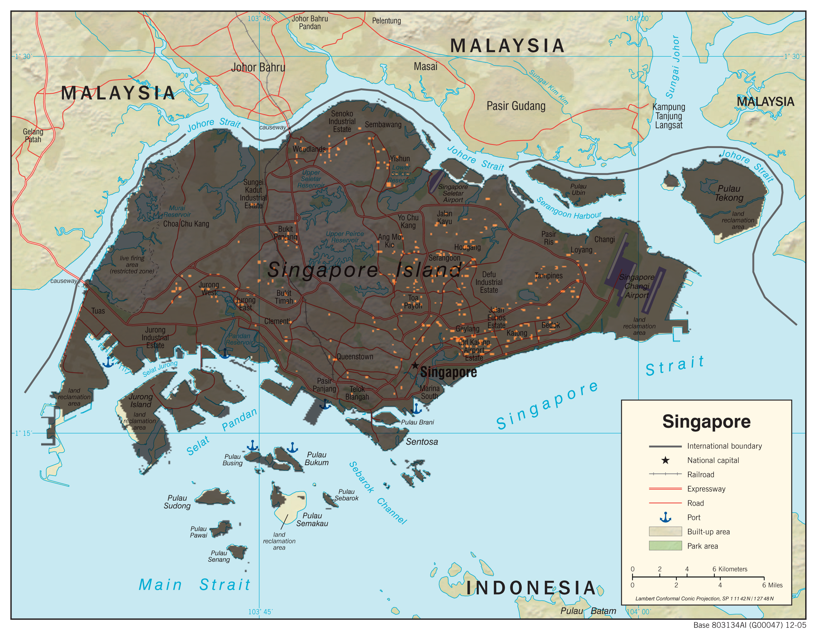

# Singapore_Dengue
### Predicting Dengue Fever outbreaks in Singapore
Machine Learning Project on predicting Dengue Fever cases in Singapore
#### The repository is currently under work-in-progress
#### Contributors:
##### - Yuan Lai (https://github.com/ylurban)
##### - Diego Garzòn (https://github.com/Diegosmiles)
##### - Bilguun Turboli (https://github.com/bilguun)

- Topography of Singapore, by ylurban
